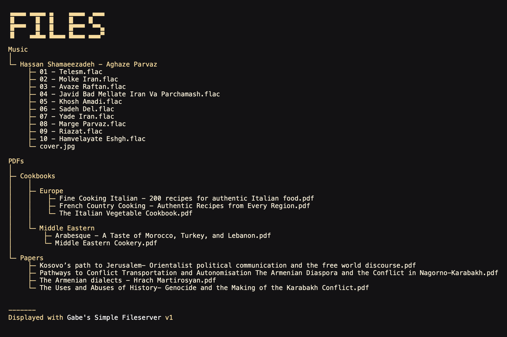
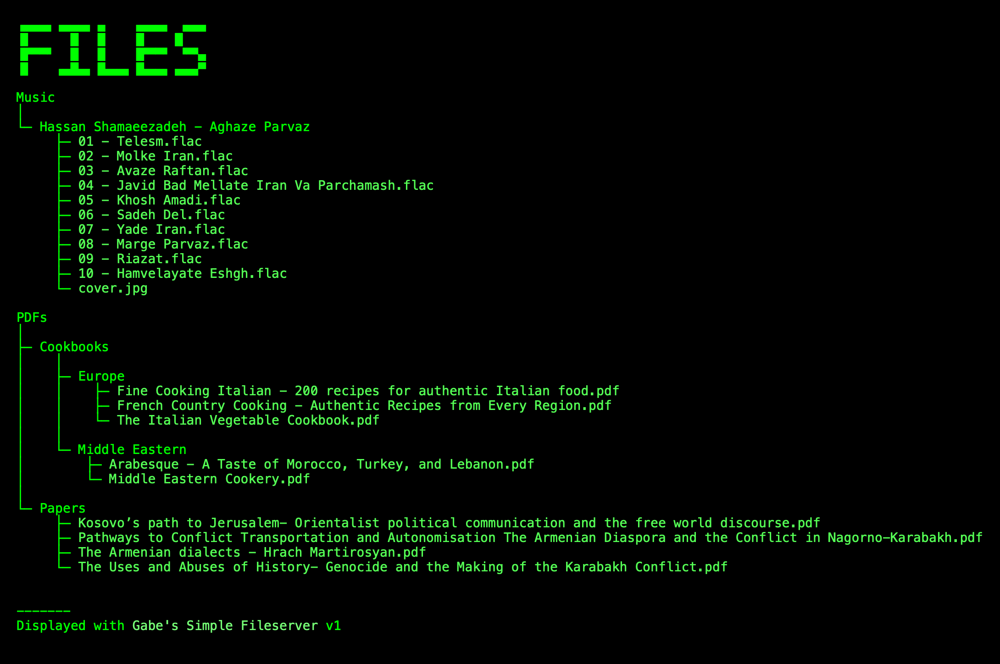
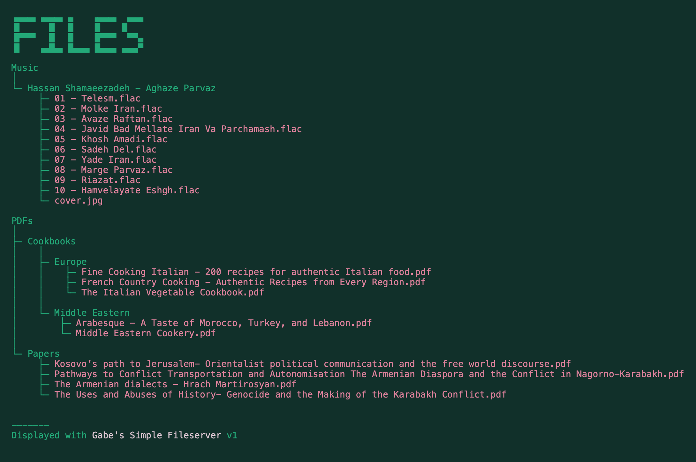
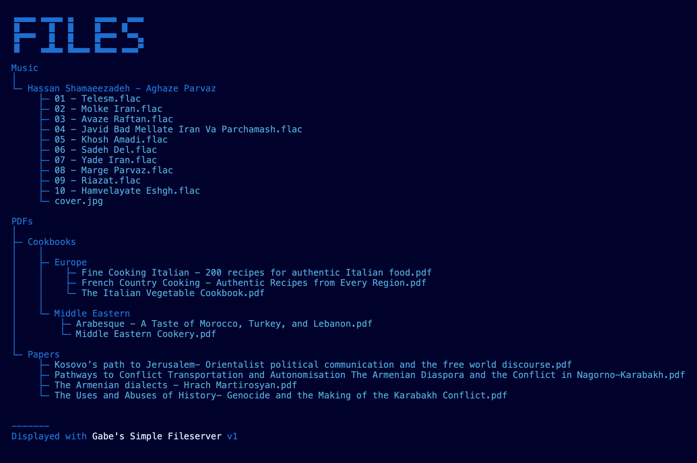
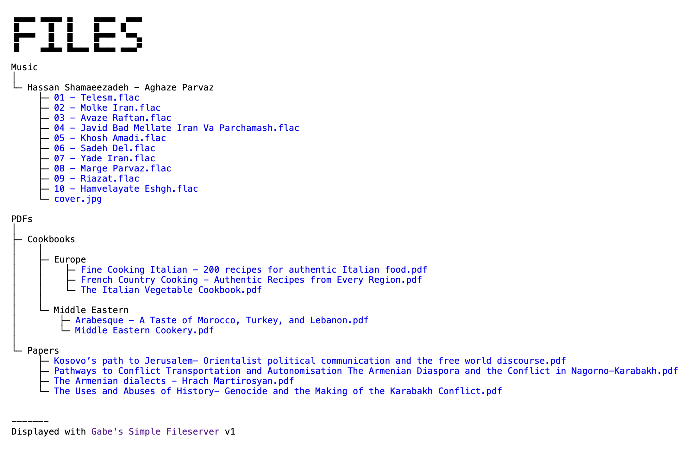
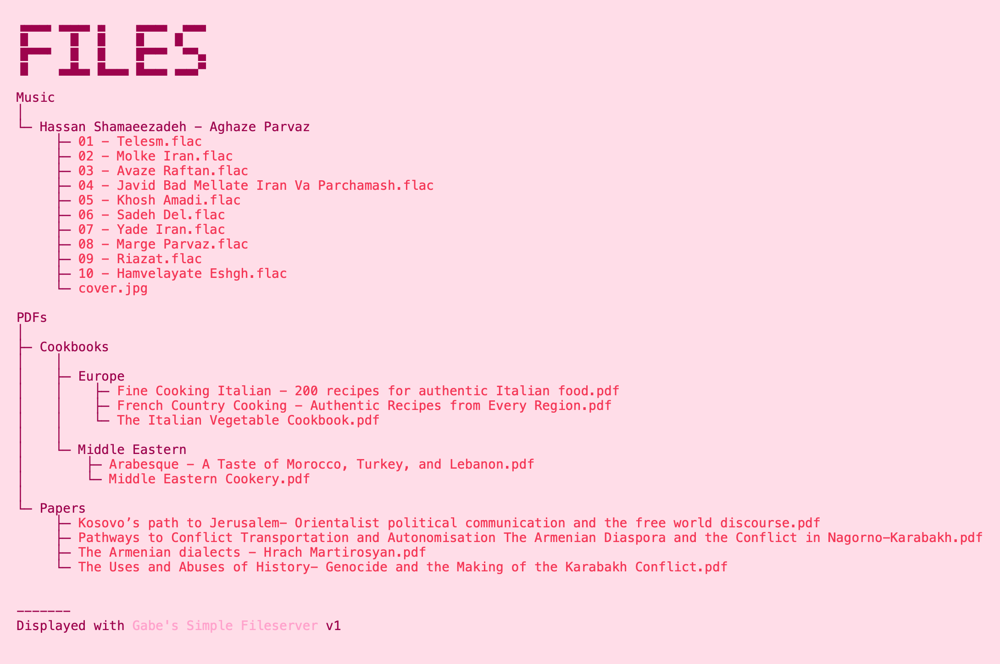

Gabe's Simple Fileserver
---

### Why?

When I was switching my website over from a static server to a NextJS server, I realized I could no longer host static files.

This is my way around it. A light-weight framework-less server that can host static files and serve them over HTTP.

### Usage

Run `npm i` to install the server, then run `npm run start` to start the server. Navigate to http://localhost:3000 in your browser to view the files.

### Customization

This program is highly customizable.

To change the style of the file listing, change the `style` field in the config file.

    
By default it comes with the following styles:

coffee

gabe (based on my [portfolio website](https://gabrielchantayan.com))

hacker

lotus

ocean

old (based on raw HTML)

rose

To ignore files from showing, add them to the `ignored_files` array in the config file.

To change the header/footer, modify `html-fragments.js`